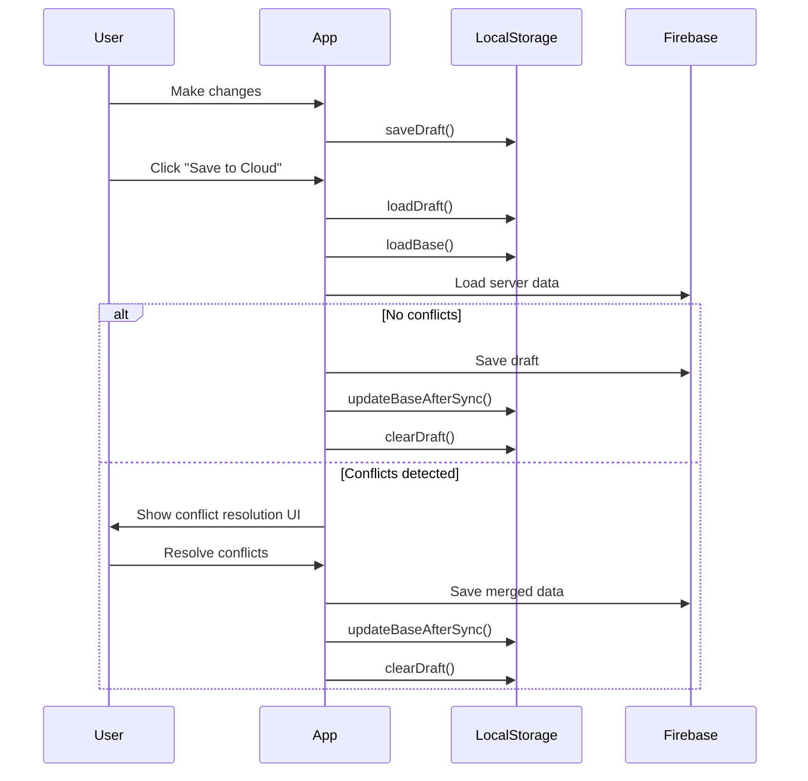

## Overview

CV Builder uses browser localStorage to persist draft data locally, enabling offline editing and preventing data loss. The system maintains two versions of data:

1. **Draft** - Current working state (unsaved changes)
2. **Base** - Last synced state (for conflict detection)

All storage operations are implemented in `lib/backend/cvDraftStorage.ts`.

## Storage Keys

Two localStorage keys are used:

```typescript lib/backend/cvDraftStorage.ts
const STORAGE_KEY = "cv-draft";
const BASE_KEY = "cv-draft-base"; // Key for base version (last synced state)
```

<ParamField path="cv-draft" type="DraftData">
  Current working draft with unsaved changes
</ParamField>

<ParamField path="cv-draft-base" type="BaseData">
  Last synced state used for three-way merge conflict detection
</ParamField>

## Data Structures

### DraftData

Stored in `cv-draft` key:

```typescript lib/backend/cvDraftStorage.ts
export interface DraftData {
  data: CVData;
  savedAt: string;
}
```

<ResponseField name="data" type="CVData" required>
  The actual resume data
</ResponseField>

<ResponseField name="savedAt" type="string" required>
  ISO 8601 timestamp of when draft was saved
</ResponseField>

### BaseData

Stored in `cv-draft-base` key:

```typescript lib/types.ts
export interface BaseData {
  data: CVData;
  savedAt: string;
}
```

<Note>
  BaseData has the same structure as DraftData but represents the last successfully synced state from Firebase.
</Note>

## Core Functions

### Save Draft

Save current resume data to localStorage:

```typescript lib/backend/cvDraftStorage.ts
export function saveDraft(data: CVData): boolean {
  try {
    const draft: DraftData = {
      data,
      savedAt: new Date().toISOString(),
    };
    localStorage.setItem(STORAGE_KEY, JSON.stringify(draft));
    return true;
  } catch (error) {
    console.error("[CVDraft] Failed to save draft:", error);
    return false;
  }
}
```

**Usage:**

```typescript
import { saveDraft } from '@/lib/backend/cvDraftStorage';

const success = saveDraft(cvData);
if (success) {
  console.log('Draft saved successfully');
}
```

### Load Draft

Load and validate draft from localStorage:

```typescript lib/backend/cvDraftStorage.ts
export function loadDraft(): DraftData | null {
  try {
    const stored = localStorage.getItem(STORAGE_KEY);
    if (!stored) return null;

    const draft = JSON.parse(stored) as DraftData;

    // Validate the data structure
    const validatedData = validateCVData(draft.data);
    if (!validatedData) {
      console.warn("Draft data failed validation, clearing");
      clearDraft();
      return null;
    }

    return {
      data: validatedData,
      savedAt: draft.savedAt,
    };
  } catch (error) {
    console.error("Failed to load draft:", error);
    return null;
  }
}
```

**Features:**
- Returns `null` if no draft exists
- Validates data structure before returning
- Automatically clears invalid drafts
- Handles JSON parse errors gracefully

**Usage:**

```typescript
import { loadDraft } from '@/lib/backend/cvDraftStorage';

const draft = loadDraft();
if (draft) {
  console.log('Draft loaded:', draft.savedAt);
  setCvData(draft.data);
} else {
  console.log('No draft found, using initial data');
}
```

### Check Draft Existence

```typescript lib/backend/cvDraftStorage.ts
export function hasDraft(): boolean {
  try {
    return localStorage.getItem(STORAGE_KEY) !== null;
  } catch (error) {
    console.error("[CVDraft] Failed to check draft existence:", error);
    return false;
  }
}
```

### Clear Draft

```typescript lib/backend/cvDraftStorage.ts
export function clearDraft(): boolean {
  try {
    localStorage.removeItem(STORAGE_KEY);
    return true;
  } catch (error) {
    console.error("[CVDraft] Failed to clear draft:", error);
    return false;
  }
}
```

## Base Version Functions

The base version tracks the last successfully synced state, enabling three-way merge during conflict resolution.

### Save Base

```typescript lib/backend/cvDraftStorage.ts
export function saveBase(data: CVData): boolean {
  try {
    const base: BaseData = {
      data,
      savedAt: new Date().toISOString(),
    };
    localStorage.setItem(BASE_KEY, JSON.stringify(base));
    return true;
  } catch (error) {
    console.error("[CVDraft] Failed to save base:", error);
    return false;
  }
}
```

<Note>
  Call `saveBase()` after every successful Firebase sync (both save and load operations).
</Note>

### Load Base

```typescript lib/backend/cvDraftStorage.ts
export function loadBase(): BaseData | null {
  try {
    const stored = localStorage.getItem(BASE_KEY);
    if (!stored) return null;

    const base = JSON.parse(stored) as BaseData;

    // Validate the data structure
    const validatedData = validateCVData(base.data);
    if (!validatedData) {
      console.warn("Base data failed validation, clearing");
      localStorage.removeItem(BASE_KEY);
      return null;
    }

    return {
      data: validatedData,
      savedAt: base.savedAt,
    };
  } catch (error) {
    console.error("[CVDraft] Failed to load base:", error);
    return null;
  }
}
```

### Update Base After Sync

```typescript lib/backend/cvDraftStorage.ts
export function updateBaseAfterSync(data: CVData): boolean {
  return saveBase(data);
}
```

**Usage in sync flow:**

```typescript
import { updateBaseAfterSync } from '@/lib/backend/cvDraftStorage';
import { doc, setDoc } from 'firebase/firestore';

// After successful save to Firebase
await setDoc(resumeRef, { data: cvData, updatedAt: new Date() });
updateBaseAfterSync(cvData); // Update base for future conflict detection

// After successful load from Firebase
const serverData = await getDoc(resumeRef);
updateBaseAfterSync(serverData.data); // Update base
```

## Utility Functions

### Check for Meaningful Content

Determines if resume has actual user data (not just empty/default values):

```typescript lib/backend/cvDraftStorage.ts
export function hasMeaningfulContent(data: CVData): boolean {
  // Check personal info for non-empty string values
  const personalInfoFields = [
    data.personalInfo.fullName,
    data.personalInfo.email,
    data.personalInfo.phone,
    data.personalInfo.address,
    data.personalInfo.jobTitle,
    data.personalInfo.summary,
    data.personalInfo.website,
    data.personalInfo.linkedin,
    data.personalInfo.github,
    data.personalInfo.profileImageUrl,
  ];

  const hasPersonalInfo = personalInfoFields.some(
    (v) => typeof v === "string" && v.trim().length > 0
  );

  // Check for any array with items
  const hasArrayContent =
    data.experience.length > 0 ||
    data.education.length > 0 ||
    data.projects.length > 0 ||
    data.achievements.length > 0 ||
    data.languages.length > 0 ||
    data.skills.length > 0;

  // Check for non-default references
  const hasReferences = (data.references || "").trim().length > 0 &&
    data.references !== "Available upon request.";

  return hasPersonalInfo || hasArrayContent || hasReferences;
}
```

**Use cases:**
- Show "unsaved changes" indicator
- Prompt user before navigating away
- Decide whether to show "discard draft" option

### Check for Data Changes

Compare two CVData objects to detect differences:

```typescript lib/backend/cvDraftStorage.ts
export function hasDataChanged(a: CVData, b: CVData): boolean {
  // Compare arrays by checking if they have different lengths or different items
  const arraysDiffer = <T extends { id: string }>(arrA: T[], arrB: T[]): boolean => {
    if (arrA.length !== arrB.length) return true;
    return JSON.stringify(arrA) !== JSON.stringify(arrB);
  };

  // Compare personal info
  const personalA = JSON.stringify(a.personalInfo);
  const personalB = JSON.stringify(b.personalInfo);
  if (personalA !== personalB) return true;

  // Compare arrays
  if (arraysDiffer(a.experience, b.experience)) return true;
  if (arraysDiffer(a.education, b.education)) return true;
  if (arraysDiffer(a.projects, b.projects)) return true;
  if (arraysDiffer(a.achievements, b.achievements)) return true;
  if (arraysDiffer(a.languages, b.languages)) return true;
  if (arraysDiffer(a.skills, b.skills)) return true;
  if (JSON.stringify(a.sectionOrder) !== JSON.stringify(b.sectionOrder)) return true;
  if (JSON.stringify(a.hiddenSections) !== JSON.stringify(b.hiddenSections)) return true;
  if ((a.references || "") !== (b.references || "")) return true;
  if ((a.template || "default") !== (b.template || "default")) return true;

  return false;
}
```

## Sync Behavior

The typical sync flow:



## Best Practices

<AccordionGroup>
  <Accordion title="Auto-save drafts frequently">
    Save drafts on every significant change (debounced):
    
    ```typescript
    import { useDebouncedCallback } from 'use-debounce';
    import { saveDraft } from '@/lib/backend/cvDraftStorage';
    
    const debouncedSave = useDebouncedCallback(
      (data: CVData) => {
        saveDraft(data);
      },
      1000 // 1 second debounce
    );
    
    // Call on every change
    const handleDataChange = (newData: CVData) => {
      setCvData(newData);
      debouncedSave(newData);
    };
    ```
  </Accordion>
  
  <Accordion title="Always update base after sync">
    Critical for conflict detection:
    
    ```typescript
    // After successful save
    await saveToFirebase(cvData);
    updateBaseAfterSync(cvData);
    
    // After successful load
    const serverData = await loadFromFirebase();
    updateBaseAfterSync(serverData);
    ```
  </Accordion>
  
  <Accordion title="Handle storage quota errors">
    localStorage has a ~5-10MB limit:
    
    ```typescript
    try {
      saveDraft(cvData);
    } catch (error) {
      if (error.name === 'QuotaExceededError') {
        // Clear old data or prompt user
        console.error('Storage quota exceeded');
        // Consider clearing base version
        clearBase();
        saveDraft(cvData); // Retry
      }
    }
    ```
  </Accordion>
  
  <Accordion title="Validate data on load">
    Always validate loaded data:
    
    ```typescript
    const draft = loadDraft(); // Already includes validation
    if (draft) {
      setCvData(draft.data);
    } else {
      // Use initial data or load from server
      setCvData(initialCVData);
    }
    ```
  </Accordion>
</AccordionGroup>

## Error Handling

All storage functions return `boolean` or `null` to indicate success/failure:

```typescript
const saved = saveDraft(cvData);
if (!saved) {
  // Show error notification
  toast.error('Failed to save draft locally');
}

const draft = loadDraft();
if (draft === null) {
  // Draft doesn't exist or is invalid
  console.log('No valid draft found');
}
```

## Storage Lifecycle

```typescript
// 1. Initialize app - load draft
const draft = loadDraft();
if (draft) {
  setCvData(draft.data);
  console.log('Loaded draft from:', new Date(draft.savedAt));
}

// 2. User makes changes - save draft
const handleChange = (newData: CVData) => {
  setCvData(newData);
  saveDraft(newData);
};

// 3. User saves to cloud - update base
const handleSaveToCloud = async () => {
  await saveToFirebase(cvData);
  updateBaseAfterSync(cvData);
  clearDraft(); // Optional: clear draft after successful sync
};

// 4. User logs out - clear data
const handleLogout = () => {
  clearDraft();
  clearBase();
};
```

## Next Steps

<CardGroup cols={2}>
  <Card title="Conflict Resolution" icon="code-merge" href="/advanced/conflict-resolution">
    Learn how three-way merge uses base data
  </Card>
  <Card title="Data Structure" icon="database" href="/advanced/data-structure">
    Explore complete type definitions
  </Card>
</CardGroup>